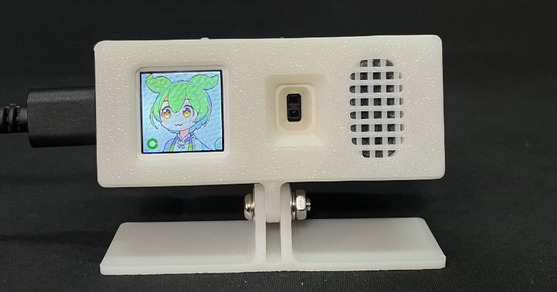
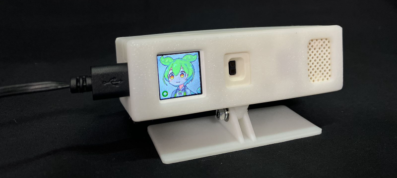
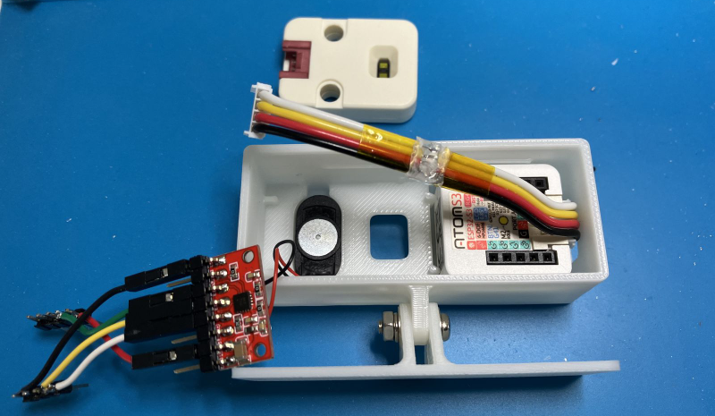
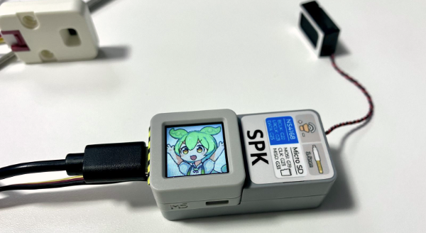

# 30分以上PCの前にいるとずんだもんが休憩を促すデバイス for M5Stack ATOMS3



## これは何？
30分以上PCの前にいたら休憩を促すメッセージを再生するデバイスです。PCの画面に長時間向かっていると目に負担がかかるので、目を休めつつ、気分転換を図るのが狙いです。腰痛防止にもいいのだ。

## 必要なもの
* M5Stack [ATOMS3](https://shop.m5stack.com/products/atoms3-dev-kit-w-0-85-inch-screen)
* M5Stack [Unit-ToF4M](https://shop.m5stack.com/products/time-of-flight-distance-unit-vl53l1x) (VL53L1X)
* M5Stack [Speaker 2 Hat](https://shop.m5stack.com/products/m5stickcplus-speaker-2-hat-max98357) (MAX98357)、（[ATOMIC Speaker Base](https://shop.m5stack.com/products/atomic-speaker-base-ns4168)も使用可）

## しくみ
ToFセンサーを使って対象物（人間）までの距離を測定します。指定した範囲内に人が存在する場合、PCの前にいると判断します。PCの前にいる時間が一定時間を超えると働きすぎと判断して、休憩を促すメッセージを再生します。

物体を検出するセンサーとしてはPIRセンサーが有名ですが、PIRセンサーでは距離が測れないため、PCの前にいるのか、離れた場所にいるのかを区別できません。また検知する角度も広いので他の人にも反応してしまいます。今回使用したUnit-ToF4Mは検知する範囲の角度が狭いので、人間くらいの大きさならピンポイントで測定できます。

## ディレクトリ構成
* [src/](src/) ... M5Stackのプログラム
* [psdlayers2rgb565/](psdlayers2rgb565/) ... PSD形式の画像からRGB565形式に一括変換するプログラム
* [STL/](STL/) ... ケースの3Dプリント用データ

<br>

# 作り方

## ライブラリのインストール
以下のライブラリがインストールされていない場合は、先にインストールします。
* M5Unified
* ESP8266Audio
* VL53L1X
* Ticker

## プログラムのコンパイル
zundabreak2 というフォルダを作成して、src/ フォルダ内のファイルをコピーします。コンパイルしてATOMS3に書き込みます。なお、オプション設定はUSB CDC On Boot: Enabled、USB Mode: Hardware CDC and JTAGにしています。

## ケースをプリントする場合
STLフォルダに3種類のケースが入っているので好きなのを使ってください。
* STL/Standard ... 改造・はんだ付け不要でジャンパーワイヤーで接続できます。
* STL/Mini ... コンパクトなタイプ。スピーカーをケースから取り出してはんだ付けします。
* STL/misc ... Miniのスタンド部分なしバージョン

脱落防止の突起があるのでケースを広げながら出し入れしてみてください。かなり硬めです。ATOMS3を取り出すときは、画面部分を強く押さないように注意！取り出すときはケースをニッパ等で破壊することを推薦します。

## ケースを使わない場合
[Speaker 2 Hat](https://shop.m5stack.com/products/m5stickcplus-speaker-2-hat-max98357) ではなく [ATOMIC Speaker Base](https://shop.m5stack.com/products/atomic-speaker-base-ns4168) を使えばジャンパーワイヤーなしで使えます。ピンアサインはATOMIC Speaker Baseに合わせていますので、そのままコンパイルしても使えます。

## 配線
はじめにATOMS3のGroveポートとToFセンサーを接続します。次にATOMS3のGPIOポートとスピーカーを接続します。ピンアサインは以下の通り。
| Speaker 2 HAT | ATOMS3 | 参考(M5StickC Plusのピンアサイン) |
| ------------- | ------------- | ------------- |
| GND | GND | GND |
|  |  | 5V |
| BCLK | G5 | G26 |
| SDATA | G38 | G36/G25 |
| LRCK | G39 | G0 |
|  |  | BAT |
| 3V3 | 3V3 | 3V3 |
|  |  | 5V |

Speaker 2 HATはM5StickC Plus用の製品なので、そのままでは使用できませんが、ATOMS3のGPIOに合わせて接続してあげれば使用できます。

## センサーが反応する距離を調整
自分の環境に合わせてセンサーが反応する距離を調整します。ボタン（画面の方）を押しながら電源を入れるとデバッグモードに入ります。デバッグモードでは距離(cm)と範囲のゲージが表示されるので、もし合わない場合は後述するカスタマイズのところを参考に値を修正してください。

## 電源オン
デフォルトでは指定した範囲内に居る場合は、アヒルちゃんが表示されます。ToFセンサーは指向性が高いので、正面に置いていると、体を動かしたときに範囲外になってしまうかもしれません。アヒルちゃんで確認しましょう。もし範囲外になって使いにくい場合は、横側に置くという手もあります。

## ボタン操作
短押し ... いきなり休憩モード<br>
長押し ... 次の状態へ遷移

<br>

# カスタマイズ

## 基本的なカスタマイズ方法
zundabreak2.ino の冒頭に設定項目があるので、好みで調整してください。
| 変数名 | 用途 | 単位 | デフォルト値 |
| ------------- | ------------- | ------------- | ------------- |
| WORK_LIMIT | 休憩を促すまでの時間 | s | 1800 | 
| BREAK_TIME_LONG | 休憩の長さ | s | 90 |
| DISPLAY_DISTANCE_MIN | PCの前にいると判断する位置 MIN | mm | 250 |
| DISPLAY_DISTANCE_MAX | PCの前にいると判断する位置 MAX | mm | 750 |
```cpp
const uint32_t WORK_LIMIT = 1800;       // 30分以上働いたら休憩を促す(s)
const uint32_t BREAK_TIME_LONG = 90;    // 休憩の長さ(s)
const int DISPLAY_DISTANCE_MIN = 250;   // PCの前にいると判断する位置 MIN (mm)
const int DISPLAY_DISTANCE_MAX = 750;   // PCの前にいると判断する位置 MAX (mm)
```

## 応用的ななカスタマイズ
```cpp
const int TIRED_LIMIT_1 = 85;   // 疲労レベル閾値1 (0-100)  85=約25分後
const int TIRED_LIMIT_2 = 95;   // 疲労レベル閾値2 (0-100)  95=約28分後
const bool SHOW_DISTANCE_GAUGE = true;  // 距離確認用のゲージを常に表示する
const bool SHOW_DISTANCE_AHIRU = true;  // 距離確認用のアヒルちゃんを表示する
const uint32_t BLINK_TIME_BASE = 2000;  // まばたき時間　基本間隔
const uint32_t BLINK_TIME_RAND = 2000;  // まばたき時間　ランダム追加 max
const uint32_t BLINK_TIME_CLOS = 150;   // まばたき時間　閉じてる時間
const uint32_t KYORO_TIME_BASE = 1500;  // キョロキョロ時間　基本間隔
const uint32_t KYORO_TIME_RMAX = 2000;  // キョロキョロ時間　ランダム追加 max
```

## 音声を変えたい
自分でWAVファイルを作成することもできます。data_sound_zundamon.h に変数名のところを変えてデータをコピペしてください。変換は psdlayers2rgb565/ に入ってる file2h.py を使うと便利です。Pythonが必要です。ビットレートを24KHz以外にする場合は適宜修正してください。
```
python file2h.py input.wav output.h
```

## 音量を変えたい
WAVファイル作成の段階で変更する必要があるそうです。（とChatGPTが言ってた）

## 表情を変えたい
ずんだもんのアバターは体、右腕、左腕、眉毛、目、口、アヒルちゃん、それぞれのパーツを組み合わせて生成されています。この数字の部分を変えれば別のパーツになります。番号は data_image_zundamon128.h の「画像パーツの部位別テーブル」のところを参考にしてみてください。
```cpp
  avatar.changeParts("body", 0);    // 体
  avatar.changeParts("rhand", 0);   // 右腕
  avatar.changeParts("lhand", 0);   // 左腕
  avatar.changeParts("eyebrow", 0); // 眉毛
  avatar.changeParts("eye", 1);     // 目
  avatar.changeParts("mouth", 0);   // 口
  avatar.changeParts("ahiru", 0);   // アヒル
```
なお、まばたきやキョロキョロ（視線を左右に変えること）は別途設定しています。キョロキョロは変数 kyoroEyePattern で設定しています。
```cpp
const uint8_t kyoroEyePattern[3][kyoroEyeNum] = {  // キョロキョロする目のインデックス番号：目　普通
  { 3,1,2,1 }, { 6,4,5,4 }, { 9,7,8,7 }   // 元気なとき、少し疲れたとき、かなり疲れたとき
};
```
まばたきは以下のように設定しています。
```cpp
avatar.setBlink("eye", 1, 0);
```

## 別の画像を使いたい
ずんだもんじゃなくて四国めたんがいいですか？ psdlayers2rgb565/ はPSD形式の画像ファイルからC++のソースコード形式に変換するプログラムが入ってますので、これを使えばできると思います。Pythonが必要です。詳しくは[こちら](https://github.com/kaz-mac/zundachan/tree/main/tools)にあるズンダチャン用に作ったドキュメントを参考にしてください。

主な同梱ファイル
* image_zundamon128.ini ... 坂本アヒルさんのずんだもん立ち絵素材から.hファイルに変換するための設定ファイル
* convert_zundamon128.bat ... 一連の変換処理を一発で行うバッチファイル
設定ファイルの記述方法は image_zundamon128.ini にコメントがあります。


## License
個別に表記しているものを除き、プログラムは[MIT license](https://opensource.org/licenses/MIT)です。<br>
音声データ、画像データ、およびキャラクターに関してはライセンス・利用規約が異なります。

[東北ずん子ずんだもんプロジェクト　キャラクター　利用の手引き](https://zunko.jp/guideline.html)<br>
[ずんだもん立ち絵素材](https://www.pixiv.net/artworks/92641351)<br>
[VOICEVOX ソフトウェア利用規約](https://voicevox.hiroshiba.jp/term/)<br>

## Credit
* 画像データ 坂本アヒルさん
* キャラクター 東北ずん子ずんだもんプロジェクト
* 音声データ VOICEVOX: ずんだもん


## 作例
STL/Standatd/ のケースを使用した場合（ジャンパーワイヤーで配線）


STL/Mini/ のケースを使用した場合（内部）


ATOMIC Speaker Baseを使用した例


